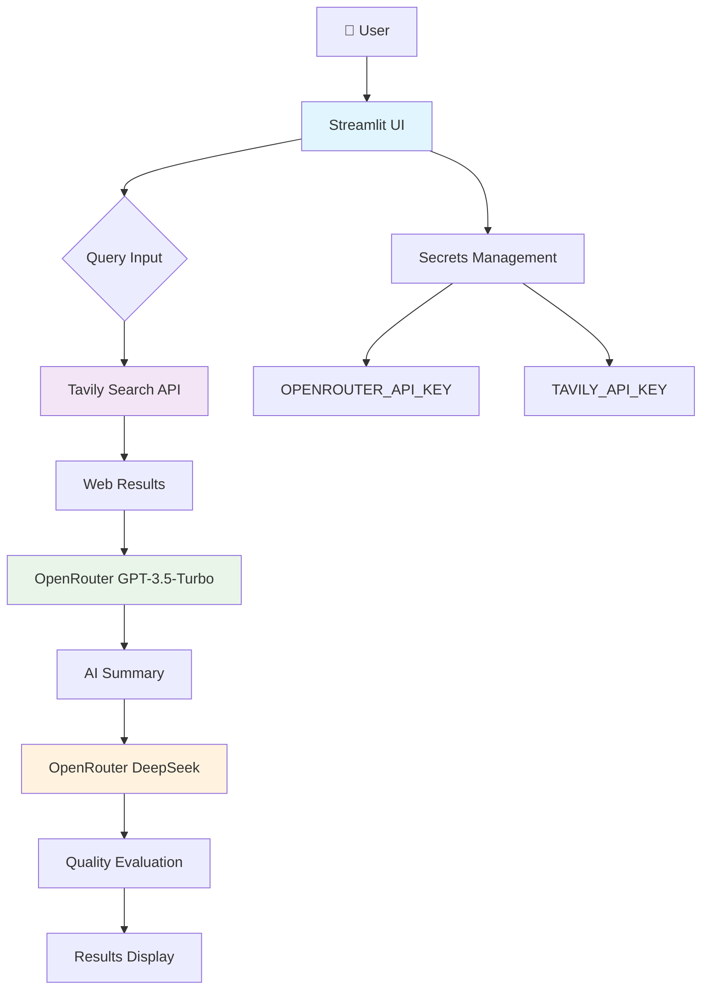

# 🌍 NGO Research Assistant

A Streamlit-based AI-powered research tool that helps users discover and learn about NGOs worldwide. The app combines web search capabilities with AI analysis to provide comprehensive NGO information and quality evaluations.

## Architecture Overview



**Architecture Components:**
- **Frontend**: Streamlit web interface for user interaction
- **Search Layer**: Tavily API for real-time web search
- **AI Processing**: OpenRouter API with GPT-3.5-Turbo for summarization and DeepSeek for evaluation
- **Security**: Streamlit secrets management for API keys
- **Data Flow**: 3-step pipeline (Search → Summarize → Evaluate)

## Features

- **Web Search Integration**: Real-time search using Tavily API for current NGO information
- **AI-Powered Summarization**: GPT-3.5-Turbo generates concise, relevant answers
- **Quality Evaluation**: DeepSeek AI evaluates answer accuracy, clarity, and usefulness
- **Interactive UI**: Clean Streamlit interface with clickable search results
- **Cloud Deployment Ready**: Optimized for Streamlit Cloud with secure secret management

## Task Decomposition & Specs

### Workflow Breakdown

The application follows a 3-step research pipeline:

#### Step 1: Web Search (`tavily.search()`)
**Purpose**: Gather current, relevant information from the web about the user's NGO query.

**Input**:
- `query` (string): User's search query (e.g., "NGOs in India 2026")
- `api_key` (string): Tavily API key from secrets

**Output**:
- `search_result` (dict): Contains:
  - `results` (list): Array of search result objects with:
    - `title` (string): Page title
    - `url` (string): Full URL
    - `content` (string): Snippet/content preview
    - `score` (float): Relevance score

**Quality Criteria**:
- Returns 5-10 relevant results
- Results include diverse sources (news, NGO sites, reports)
- Content is current and authoritative

#### Step 2: Answer Generation (`client.chat.completions.create()`)
**Purpose**: Synthesize search results into a coherent, user-friendly summary.

**Input**:
- `search_result` (dict): Raw search results from Step 1
- `model` (string): "gpt-3.5-turbo"
- `messages` (list): Single user message with format: `f"Summarize:\n{search_result}"`

**Output**:
- `answer` (string): AI-generated summary of search results
- Response structure: `response.choices[0].message.content`

**Quality Criteria**:
- Concise yet comprehensive (200-500 words)
- Neutral, factual tone
- Includes key facts, organizations, and trends
- Avoids speculation about future events

#### Step 3: Quality Evaluation (`client.chat.completions.create()`)
**Purpose**: Provide objective assessment of the generated answer's quality.

**Input**:
- `answer` (string): Generated answer from Step 2
- `model` (string): "deepseek/deepseek-chat"
- `messages` (list): Evaluation prompt with criteria

**Output**:
- `evaluation` (string): Structured feedback containing:
  - Individual scores (1-10) for Accuracy, Clarity, Usefulness
  - Overall score (1-10)
  - Short feedback comments

**Quality Criteria**:
- Consistent scoring methodology
- Constructive, specific feedback
- Balanced assessment of strengths and weaknesses

### Input/Output Specifications

#### Global Inputs
- **OPENROUTER_API_KEY**: OpenRouter API key (required)
- **TAVILY_API_KEY**: Tavily search API key (required)

#### User Interface Inputs
- **Query Text Field**: Free-form text input for NGO research queries
- **Search Button**: Triggers the 3-step research pipeline

#### Application Outputs
- **Search Results Section**: Displays top 5 search results with:
  - Clickable titles linking to source URLs
  - Content snippets (200 chars max)
- **Answer Section**: AI-generated summary
- **Evaluation Section**: Quality assessment with scores and feedback

## Installation & Setup

### Local Development

1. **Clone the repository**:
   ```bash
   git clone https://github.com/24rautsp/ngo_reserach_assistant.git
   cd ngo_reserach_assistant
   ```

2. **Create virtual environment**:
   ```bash
   python -m venv venv
   # Windows
   venv\Scripts\activate
   # macOS/Linux
   source venv/bin/activate
   ```

3. **Install dependencies**:
   ```bash
   pip install -r requirements.txt
   ```

4. **Set up secrets**:
   Create `.streamlit/secrets.toml`:
   ```toml
   OPENROUTER_API_KEY="your-openrouter-key"
   TAVILY_API_KEY="your-tavily-key"
   ```

5. **Run locally**:
   ```bash
   streamlit run app.py
   ```

### Streamlit Cloud Deployment

1. **Push to GitHub** (already done)
2. **Create Streamlit Cloud app**:
   - Go to [share.streamlit.io](https://share.streamlit.io)
   - Connect your GitHub account
   - Select repository: `ngo_reserach_assistant`
   - Set main file: `app.py`

3. **Configure secrets**:
   - In app settings → Secrets
   - Add the same API keys as above

4. **Deploy**: The app deploys automatically

## Usage Examples

### Basic NGO Research
**Query**: "top NGOs working on education in India"

**Expected Output**:
- Search results from NGO directories, news articles, impact reports
- Summary highlighting major organizations, their focus areas, and achievements
- Evaluation assessing completeness and source quality

### Funding and Trends
**Query**: "NGO funding trends 2024"

**Expected Output**:
- Recent articles about funding challenges and opportunities
- Analysis of funding sources (government, CSR, international donors)
- Evaluation of data recency and predictive accuracy

### Regional Focus
**Query**: "environmental NGOs in Southeast Asia"

**Expected Output**:
- Regional NGO networks and partnerships
- Specific organizations working on climate change, conservation
- Geographic distribution and collaboration patterns

## API Dependencies

- **OpenRouter**: AI model hosting (GPT-3.5-Turbo, DeepSeek)
- **Tavily**: Web search and content extraction
- **Streamlit**: Web application framework

## Security Notes

- API keys are stored securely in Streamlit secrets (not committed to git)
- No user data is stored or transmitted
- All API calls include proper authentication headers

## Contributing

1. Fork the repository
2. Create a feature branch
3. Make changes with proper testing
4. Submit a pull request

## License

MIT License - see LICENSE file for details